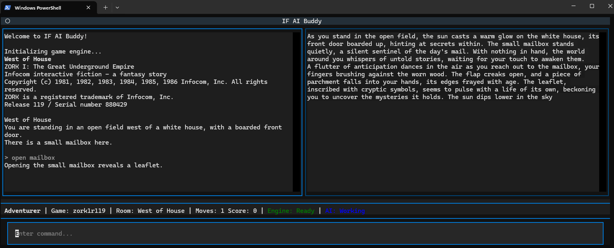

# Interactive Fiction AI Buddy (v0.1)


An Interactive Fiction companion that pairs a classic text-adventure engine with a modern **Textual TUI** and a streaming **LLM narrator**.



- Left pane: game output
- Right pane: AI narration (streamed)
- Footer: player/game/room/moves/score + engine/AI status + command input

## Features

- **Play real IF games** via a dfrotz REST wrapper (external).
- **Streaming narration** from an OpenAI-compatible model (local or hosted).
- **Schema-driven parsing** of engine transcripts (`module/game_engine_heuristics.py`).
- **Run memory** persisted in TinyDB (`module/game_memory.py`).
- **Observability-first**: JSONL logs for engine, prompts, completions, and memory transactions.

## Quickstart

### 1) Prerequisites

1. A running dfrotz REST service (see `https://github.com/opendns/zmachine-api`).
2. Python 3.11+ recommended.

Set `dfrotz_base_url` in `config/config.json` to point at that service.

### 2) Install

```bash
python -m venv .venv
# Windows PowerShell:
.\.venv\Scripts\Activate.ps1
pip install -r requirements.txt
```

### 3) Configure

Create your local config from the sample template:

```bash
# Windows PowerShell
Copy-Item .\config\config.json.sample .\config\config.json
```

Then edit `config/config.json` for your environment (URLs, model, etc.).

> Note: `config/config.json` is your local runtime config and may contain hostnames or API keys.
> Do not commit it to a public repository.

Key settings:

| Key | Meaning |
|---|---|
| `dfrotz_base_url` | Base URL of the dfrotz REST service |
| `default_game` | Game id/name as understood by the REST service |
| `player_name` | Player label (also used in log filenames) |
| `llm_provider` | `foundry` or `otheropenai` |
| `llm_model_alias_*` | Model name/alias (provider-scoped) |
| `llm_model_temperature_*` | Sampling temperature |
| `llm_model_max_tokens_*` | Generation limit |
| `llm_model_repetition_penalty_*` | Repetition penalty |

### 4) Run

```bash
python main.py
```

Optional:

```bash
python main.py --purge-data
```

## How it works (high level)

1. `main.py` loads config, initializes logging, starts `GameController`.
2. `module/game_api.py` talks to dfrotz REST and returns transcripts.
3. `module/game_engine_heuristics.py` parses canonical facts (room, moves, score, etc.).
4. `module/game_memory.py` records turns and maintains per-room `Scene` state.
5. `module/narration_job_builder.py` builds a narration prompt from memory context.
6. `module/llm_narration_helper.py` streams narration and logs the full interaction.

## Project layout

```
main.py
config/
	config.json
	response_schema.json
	game_engine_schema.json
module/
	ui_helper.py                # Textual TUI
	game_controller.py          # Orchestrator
	game_api.py                 # dfrotz REST adapter
	game_engine_heuristics.py   # Deterministic transcript parsing
	game_memory.py              # TinyDB-backed run memory
	narration_job_builder.py    # Prompt composition
	llm_narration_helper.py     # Streaming LLM transport
log/                          # JSONL logs (player-scoped + system)
res/db/                       # TinyDB memory DBs
```

## Logs & debugging

The app writes JSONL logs under `log/` (paths are config-driven). Useful files:

- `log/system.log`: app/system events
- `log/*_game_engine.jsonl`: parsed engine turns
- `log/*_llm_completions.jsonl`: prompts + model output + diagnostics
- `log/*_memory_transactions.jsonl`: memory updates
- `log/*_simple_interaction_history.log`: compact prompt/response history

## Contributing

Issues and PRs are welcome. Please:

- keep changes small and config-driven
- preserve schema-first parsing (`game_engine_heuristics` is the single source of truth)
- ensure logging remains clear enough to replay a session

## License

MIT — see `LICENSE`.

## Credits

- dfrotz REST wrapper: `https://github.com/opendns/zmachine-api`
- IF games are owned by their respective rights holders; you are responsible for providing game files where required.